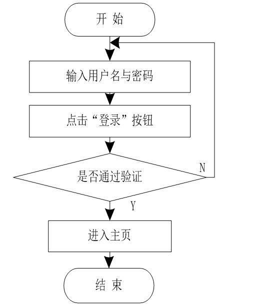
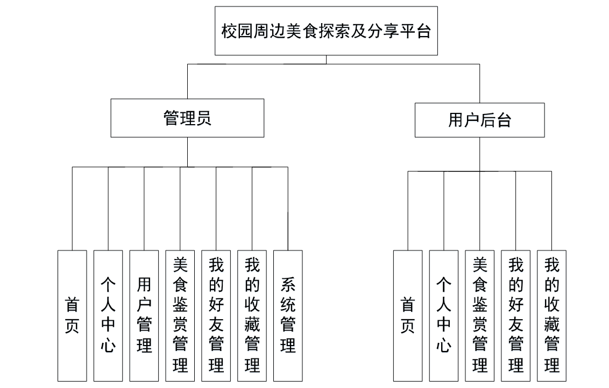
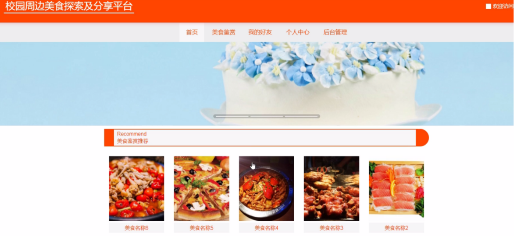
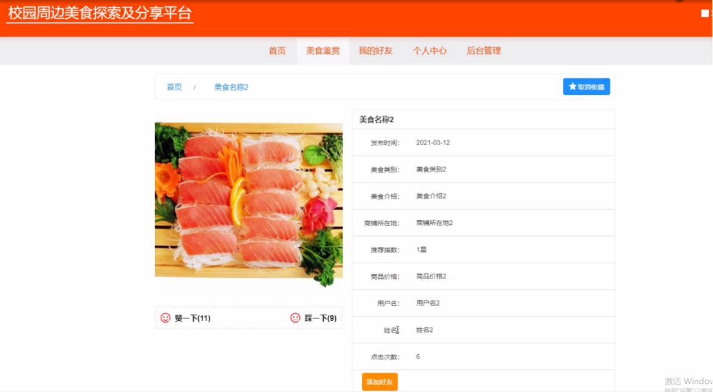
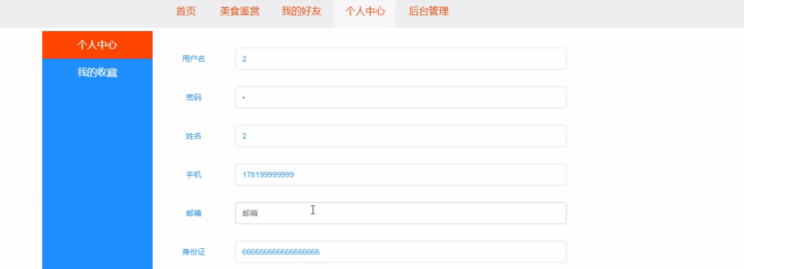
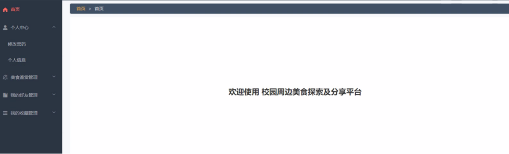
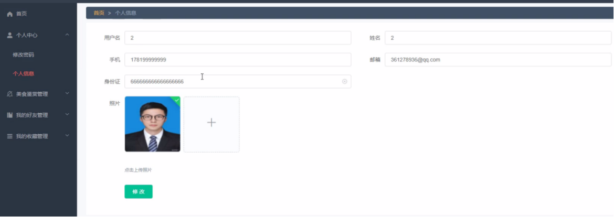
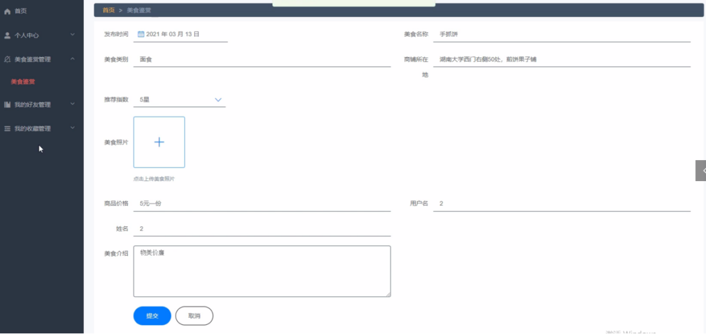
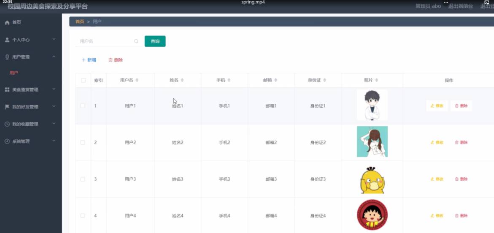

# springboot021-校园周边美食探索及分享平台

>  博主介绍：
>  Hey，我是程序员Chaers，一个专注于计算机领域的程序员
>  十年大厂程序员全栈开发‍ 日常分享项目经验 解决技术难题与技术推荐 承接各类网站设计，小程序开发，毕设等。
>  【计算机专业课程设计，毕业设计项目，Java，微信小程序，安卓APP都可以做，不仅仅是计算机专业，其它专业都可以】

## 3000套系统可挑选，获取链接：https://chaerspol.github.io/

<b>QQ【获取完整源码】：674456564</b>

<b>QQ群【获取完整源码】：1058861570</b>

### 系统架构

> 前端：html | js | css | jquery | vue
>
> 后端：springboot | mybatis
> 
> 环境：jdk1.8+ | mysql | maven

# 一、内容包括
包括有  项目源码+项目论文+数据库源码+答辩ppt+远程调试成功

# 二、运行环境

> jdk版本：1.8 及以上； ide工具：IDEA； 数据库: mysql5.7及以上；编程语言: Java

# 三、需求分析

**3.1 可行性分析**

可行性分析的目的是确定一个系统是否有必要开发、确定系统是否能以最小的代价实现。其工作主要有三个方面，分别是技术、经济和社会三方面的可行性。我会从这三个方面对网上校园周边美食探索及分享平台进行详细的分析。

**3.1.1技术可行性**

该系统主要使用JAVA、MyEclipse和MySQL数据库进行开发，Java易于学习和使用灵活。在校期间也接触过MyEclipes和MySQL数据库的课程，对此有一定的开发经验，因此开发难度不高，所以从技术上来说是可行的。

**3.1.2经济可行性**

本系统设计所选择的开发工具和服务器都是免费的开源软件，又或者是适合用户使用的免费版本，并不需要支付费用，而且由作者本人单独完成，也不存在团队费用，几乎没有经济成本，具备经济可行性。

**3.1.3社会可行性**

社会可行性主要包括法律和用户两个方面，下面将从这两方面进行分析。

(1)法律因素

本系统是学习开发所制作的程序，并不用作商业用途，是在根据实际调研的结果结合现有的网上校园周边美食探索及分享平台后得出的，而且系统制作的全部过程都是在个人的工作电脑中完成的，使用的都是开源和免费的开发环境、分析软件和数据库，不存在侵权问题。

(2)用户可行性

操作人员或者用户只需要具备一定的windows电脑操作常识，不需要精通计算机技能。此外系统管理人员，只需要在windows常识之上再熟悉下使用Tomcat服务器的操作流程，只要掌握一定的计算机知识即可，在正式上线运营之前，仅需要对操作人员进行简单的熟悉流程培训即可。所以从用户可行性上也是可行的。

**3.2总体设计原则**

一个系统要在开发和维护的过程中方便使用，必须采取一定的设计原则，其主要设计原则有：

简单性：系统功能简单易懂，只需要掌握基本的计算机操作能力即可使用。

针对性：针对特定的校园周边美食探索及分享平台用户，没有多余的其他功能，使用户可以专心使用。

实用性：能够满足用户方面的需求。

一致性：设计风格、命名规范一致，整个系统的各个功能模块色彩、摆放位置、功能等都是一致的。

先进性：本系统的代码采用读取数据的方式，方便后续开发、拓展。

**3.3 系统需求分析**

校园周边美食探索及分享平台需要满足的需求有以下几个：

（1）实现管理系统信息关系的系统化、规范化和自动化；

（2）减少维护人员的工作量以及实现用户对信息的控制和管理。

（3）方便查询信息及管理信息等；

（4）通过网络操作，改善处理问题的效率，提高操作人员利用率；

（5）考虑到用户多样性特点，要求界面简单，操作简便。

**3.4 业务流程分析**

# 四、功能模块
整个系统是由多个功能模块组合而成的，要将所有的功能模块都一一列举出来，然后进行逐个的功能设计，使得每一个模块都有相对应的功能设计，然后进行系统整体的设计。本校园周边美食探索及分享平台结构图如图

# 五、部分效果图展示
图5-1前台首页功能界面图【校园周边美食探索及分享平台，在系统首页可以查看首页、美食鉴赏、我的好友、个人中心、后台管理等内容，如图】

图5-2 用户注册、用户登录界面图【用户登录、用户注册，在用户注册页面可以填写用户名、姓名、手机、邮箱、身份证等详细内容进行注册、登录，如图】

图5-3美食鉴赏界面图【美食鉴赏，在美食鉴赏页面查看发布时间、美食名称、美食类别、美食介绍、商品所在、推荐指数、美食照片、商品价格、用户名、姓名、美食介绍等信息进行点赞、评论，也可根据需要美食鉴赏名称进行搜索操作，如图】

图5-4个人中心界面图【个人中心，在个人中心页面通过填写用户名、姓名、手机、邮箱、身份证、照片等信息进行添加、修改、删除进行更改操作，如图】

图5-5首页界面图【用户登录进入校园周边美食探索及分享平台可以查看首页、个人中心、美食鉴赏管理、我的好友管理、我的收藏管理等内容。如图】

图5-6个人信息界面图【个人中心，用户在个人信息页面中可以查看用户名、姓名、手机、邮箱、身份证、照片等信息内容，并且根据需要对已有个人信息进行查看或删除等其他详细操作，如图】

图5-7美食鉴赏管理界面图【美食鉴赏管理，用户在美食鉴赏页面中可以添加发布时间、美食名称、美食类别、美食介绍、商品所在、推荐指数、美食照片、商品价格、用户名、姓名、美食介绍等信息内容，可进行修改或删除等其他详细操作，如图】

图5-8用户信息界面图【用户管理，管理员在用户信息页面中可以查看用户名、姓名、手机、邮箱、身份证、照片等信息，并可根据需要对已有用户信息进行修改或删除等操作，如图】

 <b>完整文章</b>
 

 

## 3000套系统可挑选，获取链接：https://chaerspol.github.io/

<b>QQ【获取完整源码】：674456564</b>

<b>QQ群【获取完整源码】：1058861570</b>

